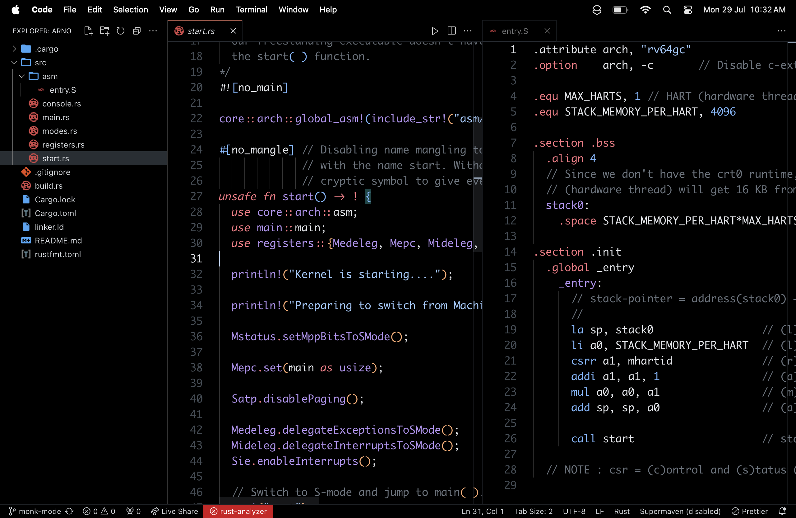

# GUIDE

<p>
	
	
	
	
	
	
	
	
</p>

I assume that you've a fresh MacOS (with M series CPU architecture) installed.

First install Nix :

```sh
curl --proto '=https' --tlsv1.2 -sSf -L https://install.determinate.systems/nix | sh -s -- install
```

Then get into a temporary Nix shell, where you'll have access to git, stow and home-manager.

```sh
nix-shell -p git stow home-manager vim
```

Clone this repository :

```sh
git clone https://github.com/Archisman-Mridha/dotfiles ~/dotfiles
cd ~/dotfiles
```

If you're on MacOS, install Homebrew by running :

```sh
unalias curl
/bin/bash -c "$(curl -fsSL https://raw.githubusercontent.com/Homebrew/install/HEAD/install.sh)"
```

You can customize [.config/home-manager/config.nix](.config/home-manager/config.nix) based on your
underlying system. Then execute the following commands :

```sh
stow --no-folding .

home-manager switch
nix run nix-darwin -- switch --flake $(pwd)/.config/home-manager

nix-channel --add https://nixos.org/channels/nixpkgs-unstable\nnix-channel --update
```

Execute these commands, if you want to cleanup Nix cache :

```sh
nix-collect-garbage -d
```

## Updating packages

Go to [./.config/home-manager/](./.config/home-manager/) and run :

```sh
nix flake update
home-manager switch
```

## CHEATSHEETS

- [Neovim](https://gist.github.com/Archisman-Mridha/41923c35fec46d46497a06bdca56cb6f)
- [Tmux](https://gist.github.com/Archisman-Mridha/d0157da78bac7e1675aa15cfdfa2eb97)
- [iTerm2](https://gist.github.com/Archisman-Mridha/b7654858acb1d7169482f1307b786a67)

## PREVIEWS

- Neovim and Tmux
  

- VSCode
  

- Wallpaper
  

## REFERENCES

- [MyNixOS](https://mynixos.com)

- [Nix home-manager tutorial: Declare your entire home directory](https://youtu.be/FcC2dzecovw)

- [How I Use Tmux With Neovim For An Awesome Dev Workflow On My Mac](https://www.youtube.com/watch?v=U-omALWIBos)

- [Setup nix, nix-darwin and home-manager from scratch on an M1 Macbook Pro](https://gist.github.com/jmatsushita/5c50ef14b4b96cb24ae5268dab613050)

- [When and how should default.nix, shell.nix and release.nix be used?](https://stackoverflow.com/questions/44088192/when-and-how-should-default-nix-shell-nix-and-release-nix-be-used)

- [Master Nix inherit Keyword in 5 Minutes](https://www.ersocon.net/articles/master-nix-inherit-keyword-in-5-minutes~c464b126-0d57-4971-9a87-2515f9aa8d19)

- [Nix Language basics](https://nix.dev/tutorials/nix-language.html)

- [Disabling System Integrity Protection](https://github.com/koekeishiya/yabai/wiki/Disabling-System-Integrity-Protection)
- [Determinate Systems : Zero to Nix](https://zero-to-nix.com)

- [Nix darwin activation script by elliott minns](https://gist.github.com/elliottminns/211ef645ebd484eb9a5228570bb60ec3)

- [Installing Arch Linux using the Arch Linux installer](https://www.youtube.com/watch?v=FxeriGuJKTM&t=354s)

- [Arch Linux Experience - Hyprland](https://www.youtube.com/watch?v=uZDPXFQYz0Q)

## TODOS

- [ ] Enable image support in Neovim
